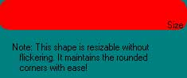



## Massively cool form shapeing on the fly

### Description

This demonstrates how to use the windows api to dynamically (and quickly) reshape a form without hogging resources. It Doesn't Even Blink! PLEASE VOTE!
 
### More Info
 
If the programmer isn't carefull in cleaning up used variables, the system will ALWAYS crash

             |
---                |---
**Submitted On**   |2001-01-22 21:19:30
**By**             |[Jeffrey Katz](https://github.com/Planet-Source-Code/PSCIndex/blob/master/ByAuthor/jeffrey-katz.md)
**Level**          |Advanced
**User Rating**    |3.7 (22 globes from 6 users)
**Compatibility**  |VB 6\.0
**Category**       |[Custom Controls/ Forms/  Menus](https://github.com/Planet-Source-Code/PSCIndex/blob/master/ByCategory/custom-controls-forms-menus__1-4.md)
**World**          |[Visual Basic](https://github.com/Planet-Source-Code/PSCIndex/blob/master/ByWorld/visual-basic.md)
**Archive File**   |[CODE\_UPLOAD140651222001\.zip](https://github.com/Planet-Source-Code/jeffrey-katz-massively-cool-form-shapeing-on-the-fly__1-14631/archive/master.zip)

### API Declarations

Alot :)

